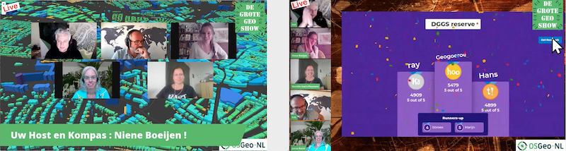
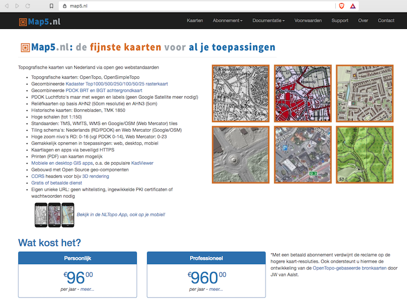

Overview of my professional life in 2020. Highlights of living and working in the Open Source Geospatial and OSGeo([.nl][1]|.[org][2])-world in 2020. Organized by &#8220;Theme&#8221;.

Yes, 2020 was a &#8220;special year&#8221; in pandemic and political terms. So much has been written and opinions expressed, that I don&#8217;t see a need to add to more here. Some of my activities below may make clear how I and we (OSGeo.nl community) dealt.



<!--

  

  

    Screenshots of De Grote Geo Show
  

-->

TL;DR. My absolute 2020-highlight was initiating and working on **[De Grote Geo Show][3]** (&#8220;DGGS, The Big Geo Show&#8221;), a live-streamed webshow in &#8220;De Wereld Draait Door&#8221;-style. This was/is a great team-effort by Dutch Open Source Geo/OSGeo.nl community members. Kudos to Erik, Niene, Mariëlle, Jonna, Willem, Hans and many many more (about 30+ folks)! We streamed 13 shows in 2020 with a huge range of subjects and (international) guests. And we&#8217;re still going strong with a **[DGGS New Year&#8217;s Show/Socializer][3]** on Sunday, Jan. 24, 2021.

Below follow 2020-highlights by theme.

### The Big Geo Show

Let&#8217;s start with the absolute 2020 highlight. It became clear in March 2020 that we had to cancel or virtualize our planned (June 2020, ITC Enschede) FOSS4G-NL conference and other OSGeo.nl events. I invested some time into &#8220;webinar streaming software&#8221;: Zoom, Jitsi, Teams WebEx etc. Those did not really appeal to me for what I had in mind.



<!--

  

  

    <strong><em>StreamYard &#8211; Backstage View</em></strong>
  

-->

For personal streaming, I was testing **[OBS Studio][38]**, streaming to Twitch.tv and YouTube. I then stumbled on **[&#8220;Learn with Jason&#8221;][39]**. Very entertaining and deeply technical at the same time. I liked the format of having guests in the stream. That triggered me to do something similar with the Open Source Geo community in the Netherlands. Long story short: I had the idea to do a short, 1 hour webshow with various subjects and guests. Before I knew we had a Telegram group of now around 30 folks with a kernel of about 6-8 and started brainstorming. The other element which added to the success was my discovery of **[StreamYard.com][40]**.


<!--

-->

Now **[StreamYard][40]** is a whole story by itself. In short it differs from all the well-known video-conf programs that it is a Cloud-based Broadcast Studio. Conceptually it is like making a real TV-show. There is a Stage (main screen) which can be &#8220;branded&#8221; in all sorts of creative, interactive ways: backgrounds, overlays, banners/tickers, video clips (e.g. for intro/outro or soapboxes), screen layouts, chat messages from viewers. All is controlled by one or more &#8220;hosts&#8221; (Dutch: &#8220;regisseurs&#8221;). Guests join &#8220;backstage&#8221; first and can be added to the &#8220;stage&#8221; when their item starts. And last but not least: the entire Stage can be streamed to multiple destinations at the same time like YouTube, Twitch.tv, LinkedIn etc. but also to custom RTMP servers. Viewers who missed the show could watch back later. StreamYard works completely in the browser, no installs needed. Ok, StreamYard is not Open Source, but their registration is very minimal: one only needs to provide an email adres to which a temporary login code is sent, no profile-filling etc. 


<!--

-->

So we just started, all of us not really familiar with providing online events and being first-timers in StreamYard. One learns quickest by just jumping into the deep, learning by doing, not bother about mistakes. We quickly adopted a format for a weekly one-hour show, always at the same time, Thursdays 4-5 PM. A central website **[tv.osgeo.nl][3]** was quickly online (with GitHub and **[Hugo][41]**!), so we can refer to a single, short URL.

The format of each show was basically to have 5-6 items in an hour. An &#8220;item&#8221; could be an interview with a guest, a technical presentation (or mixed interview/presentation), a column, community updates, a (hands-on) tutorial, a poem, or last but least a live-quiz (via Kahoot) where viewers can participate! After the first show (where we looked a bit like rabbits in headlights!), we quickly realized we need a presenter-host for the entire show. So all subsequent shows had one of us, well mainly Niene, being the talkshow-host. We also decided to do the show in Dutch, except with international guests, as to engage our local communities (OSGeo-NL, QGIS-NL, OpenStreetMap-NL).


<!--

-->

Enough theory, show me the show! As said you can watch back all shows via **[tv.osgeo.nl][3]** or directly on the **[OSGeo.nl YouTube Channel][42]**. Hell, you can even **[binge-watch all episodes][4]**! 


<!--

-->

Many shows were organized around a theme, like 3D (**[ep. 3 offcourse][43]**), Heaven&Outer Space, Corona of the Sun (**[ep. 6 on Ascension Day][44]**). We had some great guests in the show, also international guests, to name a few: Nadieh Bremer and Christian Mayer (**[ep. 7 &#8211; Visualization Special][45]**), Hugo Ledoux (TU Delft on 3D), Linda van den Brink (Geonovum) and Tom Kralidis (**[ep 11 &#8211; on OGC API Special][46]**), Anita Graser (**[ep. 9 &#8211; QGIS Special][47]**),  Naomi Bueno de Mesquita and Topi Tjukanov (**[ep 12. MapTime Special][48]**). The last show of 2020, **[ep. 13 Christmas Edition, was one big PubQuiz][49]**.


<!--

  

  

    <em><strong>NewYear on &#8220;Grote Geo Eiland&#8221;</strong></em>
  

-->

All in all we did 13 shows in 2020. And 2021? We&#8217;ll start with a Newyear Special with OSGeo-NL, QGIS-NL and OpenStreetMap-NL communities. Only the plenary first half-hour in StreamYard, then next a new platform where all can participate and mingle. Just watch and participate on sun, jan 24, 2021, 3 PM (GMT+1) via **[tv.osgeo.nl][3]**.

### Geospatial Cloud Services

Moving into providing Geospatial Cloud Services last few years, both as a source of income and to support/strengthen underlying open source projects with which they are developed. Warning: shameless ads below.

  * **[map5.nl][5]** is a subscription service for Dutch topographic, historical- and embellished hill-shade and arial maps I started to host in 2015. In 2020 the entire map5.nl server-infrastructure was moved from custom Ubuntu-installs to a complete **[Ansible][50]**/Docker-based setup.


<!--

-->

  * **[GeoQoS.com][6]** is a hosted **[GeoHealthCheck][7]** (GHC) service on a subscription basis. GHC is an uptime and QoS monitor for (OGC) web services. Customers get their own GHC instance. **[GeoQoS.com][6]** saves the burden of self-hosting GHC. Launch was in 2019, growing steady in 2020. Expect to work more on API and new UI for GeoHealthCheck (below) in 2021.


<!--

-->

  * Feb 2020 &#8211; launched **[geotoko.nl][8]**. geotoko.nl, in short GeoToko, is basically a webshop to download Dutch open geo-datasets. Here one may ask: Dutch geospatial data like Topography, Addresses and Buildings, is already open and publicly available, mainly via **[Kadaster-PDOK][51]**. So why bother reselling? This needs some explanation.


<!--

-->

  Most Dutch Open geospatial datasets, as available from governmental institutions like Kadaster, are provided in a neutral exchange-format. In practice: GML (Application Schema). Most users are not able to directly digest complex GML in their applications (or don&#8217;t want to spend time on that). For over 10 years we run the Open Source project **[NLExtract][52]** to convert these datasets into formats like PostGIS and CSV that can be directly used in applications. NLExtract itself builds on **[Stetl][11]**, an Open Source geospatial ETL-library in Python. NLExtract/Stetl is used a lot, but still will require users to install/maintain an NLExtract/Stetl installation, download datasets, run the ETL, check results etc. That may also be a bridge too far, if e.g. all a customer needs is a one-time CSV of say, all 10 million addresses in The Netherlands. So GeoToko taps into this niche, providing ready-to-use, often enriched Dutch datasets. Pricing is reasonable, compared to other providers, plus organizations and individuals may get highly reduced pricing when they work on Open data applications like OpenStreetMap.


<!--

-->

  As for development: the **[GeoToko webshop][8]** was developed with Django, Flask/nginx (Download management), Stripe (backend payments) and **[CKAN][53]**. The latter to provide a product-catalogue, sample data and metadata in general, all via **[GeoCatalogus.nl][54]**.


<!--

  

  

    <strong>GeoFabriek &#8211; Production Chain</strong>
  

-->

  Further development concerned automating the NLExtract/Stetl ETL-processes. For this a framework called GeoFabriek, &#8220;GeoFactory&#8221;, was developed. This automates the entire chain from checking new dataset versions at Kadaster, through downloading, conversions, packing for download and updating the metadata (in GeoCatalogus.nl).

### Contract Work

As my focus is more and more on providing &#8220;Geospatial Cloud Services&#8221; (see above), did not take not too much contract work in 2020, though I am always open for offerings (but may say &#8216;no&#8217;)!

  * For **[Geolicious (Germany)][55]**. Developed a Wegue **[interactive map for the German National Park Luneburger Heide][9]**. This also gave a boost to the **[Wegue Open Source project][17]** (see below). Was an honour to work together with the great **[Steve Bennett][57]** a.k.a. @stevage.

    
<!--

-->

Various new Widgets for Wegue were developed. To name a few: Enhanced Layer Tree, Enhanced Feature Info (see picture), Share Button, Routing, Multi-language, PDF Print, Download Features, Layout Improvements. Also introduced a &#8220;create-app&#8221; to have a starter app. We are in the process of merging back these new features into the Wegue core.

### Open Source Contributions

Continuous work as a contributor. Apart from some GitLab Projects, you can find/follow me best on [GitHub][10].

<!--

-->
  * [Stetl][11] &#8211; Geospatial ETL in Python, maintaining since 2011.
  * [GeoHealthCheck][12] &#8211; Service Status and QoS Checker for OGC Web Services.
  * [pygeoapi][13] &#8211; a Python server implementation of the [OGC API suite of standards][57] &#8211; joined this great project in 2019. Also in PSC.
  * [pygeoapi demo server][14] &#8211; provided the (auto-)deployment stack for the pygeoapi demo server ([code at GitHub][15]). Added [COVID-19 NL data provider][58].
  * [NLExtract][16] &#8211; ETL for Dutch geospatial datasets.
  * [Wegue][17] &#8211; geo-webclient framework based on [Vue.js][18] with OpenLayers started by [Christian Mayer][19]. Joined this great project in 2019.
  * [Heron MC][20] &#8211; Web Mapping Client based on [GeoExt][21] and OpenLayers. Yes, old tech but still in wide use. In time hope to migrate to [Wegue][17] (see above). Migrating Heron to Wegue, see first example below.


<!--

-->

  * [MapProxy][23] &#8211; joined Program Steering Committee (PSC)
  * [pg_tileserv][59] Vector Tiles directly  from PostGIS!  
    Contributed [Dockerfile][60] and [Docker-example][61] 

### More Contributions &#8211; Handy Docker Images

To support many of the Cloud services and Open Source projects, I develop and maintain [handy Docker Images][62], also available from [my DockerHub][24].

  * [docker-awstats][25] &#8211; AWStats in Docker, oldie, but very effective webstats. Deploy multiple instances in single Docker container. Highly configurable, e.g. also for [Traefik][26] access logs.
  * [docker-jmeter][27] &#8211; [Apache JMeter][28] wrapped in Docker. Over 1 million pulls!
  * [docker-mapfish-print][29] &#8211; for MapFish Print **version 3**. MapFish Print allows printing maps as PDFs.
  * [docker-mapfish-print2][30] &#8211; for MapFish Print **version 2** &#8211; This version is still used in quite some contexts, at least for [Heron][20] and [KadViewer][31].
  * [docker-rclone][32] &#8211; Docker image to perform a [rclone][63] sync based on a cron schedule, with [healthchecks.io][64] monitoring.
  * [docker-pgbackup][33] &#8211; automated/scheduled PostgreSQL/PostGIS backups for all PostgreSQL-based Docker Containers in its Docker-network. I think it is nifty: just run and forget: your Postgres backups are taken care of. Inspired by: <https://github.com/kartoza/docker-pg-backup>.

New Docker images developed in 2020:

  * [docker-mapserver][65] &#8211; Slim Docker Image for MapServer with Lighttpd FastCGI.
  * [docker-mapproxy][66] &#8211; MapProxy Docker Image adapted, slimmed, from the [YAGA Development-Team][67]. [Awaiting PR merge][68].
  * [docker-mapproxy-mapserver][69] &#8211; Docker Image for MapProxy service with built-in MapServer binaries accessed directly (no MapServer service).
  * [docker-cron][70] &#8211; Runs Unix cron, includes docker (compose) client for running remote Docker Images.

### OSGeo.nl

As chair of the board, still involved in the OSGeo Dutch Local Chapter, [OSGeo.nl][34] since its establishment in 2011.

  * Jan 12 &#8211; organizer &#8211; joint [OSGeo.nl and OpenStreetMap NL new-years party][71] at Cafe Dudok in Hilversum. Our last IRL event in 2020&#8230;.

No FOSS4G-NL, plans are for okt 2021, but hey, 13 episodes of [De Grote Geo Show][3] (see above)!

### Conferences &#8211; Attended

  * Feb 20-21 &#8211; [Vue.js Amsterdam][35] &#8211; last physically attended conf in 2020
  * Sept 21-22 &#8211; [GeoPython 2019][36] &#8211; Virtual
  * Nov 19 &#8211; [PostGIS Day 2020][72] &#8211; by crunchydata.com

Had planned: FOSSGIS-DE Freiburg (Germany), FOSS4G-EU Valmiera (Latvia), GeoPython 2020 Bilbao (Spain), FOSS4G 2020 Calgary (Canada) and OSGeo Code Sprint Athens (Greece). Was studying train-tables for all EU events&#8230;Oh well.

### Talks & Workshops &#8211; Provided

Most of my slides on [slideshare.net/justb4][37] . Below my 2020 talks.

  * Sept 21-22 &#8211; [Python Machine Learning & GeoPython 2020][73] &#8211; presented pygeoapi with Francesco Bartoli &#8211; [[slides HTML][74]]
  * Dec 7-9 &#8211; GeoNode Summit 2020 &#8211; [presented pygeoapi][75] with Francesco Bartoli, Tom Kralidis, Angelos Tzotsos &#8211; [[slides HTML][74]]
  * Nov 10 &#8211; GeoHealthCheck/[geoqos.com][6] workshop for [RIVM][76] (National Institute for Public Health and the Environment)

Probably some more, but cannot find back at this moment.

### Resolutions 2021

  * More effort into [Wegue][17] project
  * Get back into Kubernetes and containerism in general
  * Revive old GeoTracing projects  like [georambling.com][77]
  * HA projects: weather station, wildlife/bird cam, and AQ monitoring with [Home Assistant][78]
  * More hiking and rambling
  * Whatever comes around.

 [1]: https://osgeo.nl/
 [2]: https://www.osgeo.org/
 [3]: https://tv.osgeo.nl
 [4]: https://www.youtube.com/playlist?list=PLJMEnRQpAfZqCkhGh3lb3KUnXssK7Sk6C
 [5]: https://www.map5.nl/
 [6]: https://geoqos.com/
 [7]: https://geohealthcheck.org/
 [8]: https://geotoko.nl
 [9]: https://map.naturpark-lueneburger-heide.de/
 [10]: https://github.com/justb4/
 [11]: https://www.stetl.org/
 [12]: https://geohealthcheck.org
 [13]: https://pygeoapi.io/
 [14]: https://demo.pygeoapi.io/
 [15]: https://github.com/geopython/demo.pygeoapi.io
 [16]: https://nlextract.nl/
 [17]: https://github.com/meggsimum/wegue
 [18]: https://vuejs.org/
 [19]: https://github.com/chrismayer
 [20]: https://heron-mc.org/
 [21]: https://www.geoext.org/
 [22]: https://wegue.heron-mc.org/
 [23]: https://mapproxy.org
 [24]: https://hub.docker.com/u/justb4
 [25]: https://github.com/justb4/docker-awstats
 [26]: https://docs.traefik.io/
 [27]: https://github.com/justb4/docker-jmeter
 [28]: https://jmeter.apache.org/
 [29]: https://github.com/justb4/docker-mapfish-print
 [30]: https://github.com/justb4/docker-mapfish-print2
 [31]: https://kadviewer.map5.nl/
 [32]: https://github.com/justb4/docker-rclone
 [33]: https://github.com/justb4/docker-pgbackup
 [34]: https://osgeo.nl
 [35]: https://vuejs.amsterdam/
 [36]: http://2020.geopython.net/
 [37]: https://www.slideshare.net/justb4/
 [38]: https://obsproject.com/
 [39]: https://www.learnwithjason.dev/
 [40]: https://streamyard.com
 [41]: https://gohugo.io/
 [42]: https://www.youtube.com/channel/UCvSAN6ur4RoGUqxtvmgsb8g
 [43]: https://www.youtube.com/watch?v=UViczA8pvJs
 [44]: https://www.youtube.com/watch?v=8qSTPE8Gkoc
 [45]: https://www.youtube.com/watch?v=zXIfCLbuVlI
 [46]: https://www.youtube.com/watch?v=3l_a5Up8Rgc
 [47]: https://www.youtube.com/watch?v=lkfVQcp3bpI
 [48]: https://www.youtube.com/watch?v=rl4-tPbfxOE
 [49]: https://www.youtube.com/watch?v=HTgdEN3nb24
 [50]: https://www.ansible.com/
 [51]: https://pdok.nl
 [52]: https://github.com/nlextract/NLExtract
 [53]: https://ckan.org
 [54]: https://geocatalogus.nl
 [55]: https://www.geolicious.de/
 [56]: https://github.com/stevage
 [57]: https://www.opengeospatial.org/blog/2996
 [58]: https://demo.pygeoapi.io/covid-19
 [59]: https://access.crunchydata.com/documentation/pg_tileserv/latest/
 [60]: https://github.com/CrunchyData/pg_tileserv/blob/master/Dockerfile.alpine
 [61]: https://github.com/CrunchyData/pg_tileserv/tree/master/examples/docker
 [62]: https://github.com/search?q=user%3Ajustb4+docker-
 [63]: http://rclone.org/
 [64]: https://healthchecks.io/
 [65]: https://github.com/justb4/docker-mapserver
 [66]: https://github.com/justb4/docker-mapproxy
 [67]: https://yagajs.org/
 [68]: https://github.com/yagajs/docker-mapproxy/pull/18
 [69]: https://github.com/justb4/docker-mapproxy-mapserver
 [70]: https://github.com/justb4/docker-cron
 [71]: https://geoforum.nl/t/osgeo-nl-en-openstreetmap-nl-nieuwjaarsborrel-zo-13-jan-2019-hilversum/2170
 [72]: https://info.crunchydata.com/en/postgis-day-2020-crunchy-data
 [73]: http://2020.geopython.net/schedule.html
 [74]: https://pygeoapi.io/presentations/default/#/frontpage
 [75]: https://summit.geonode.org/schedule/#session-106
 [76]: https://www.rivm.nl/en
 [77]: http://georambling.com
 [78]: http://www.home-assistant.io/
